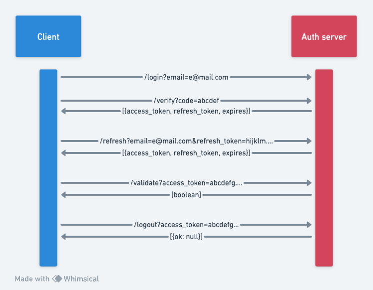

# Golem Auth Manager

## Description
Email one-time secret code authentication with good old fashioned access / refresh JWT tokens.

This can be useful if you want to have a simple authentication system for your multiple Golem Cloud workers!

Although this is not a the perfect system due to HMAC symmetric JWT signing, it is still a good starting point.
RSA can be used for added security once tinygo fully supports it.

## Data flow

1. Client sends a login request with the email address. - /login
2. Server generates a random secret code and sends it to the email address.
3. Client sends the secret code back to the server. - /verify
4. Server verifies the secret code and sends back a JWT access token and a JWT refresh token.
5. Client sends the JWT refresh token to the server. - /refresh
6. Server verifies the JWT refresh token and sends back a new JWT token pair.
7. Client sends the JWT access token to the server. - /validate
8. Server verifies the JWT access token and sends back a boolean response.

Steps 7 and 8 can be easily implemented in other Golem Cloud workers (or practically anywhere) with the same JWT HMAC secret for simple authorization.

## Setup
Unfortunately since environment variables do not work yet with tinygo, you will need to manually edit the `main.go` file to edit variables.

```go
// Mailjet API Key and Secret
auth.Initialize("your-mailjet-api-key", "your-mailjet-api-secret")
// JWT HMAC Secret (unfortunately symmetric for now, RSA is not fully supported yet on tinygo)
verify.Initialize("hmac-secret-bytes-string-for-jwt-signing")
```

You can generate a random HMAC secret with the following command:
```bash
openssl rand -base64 128
```